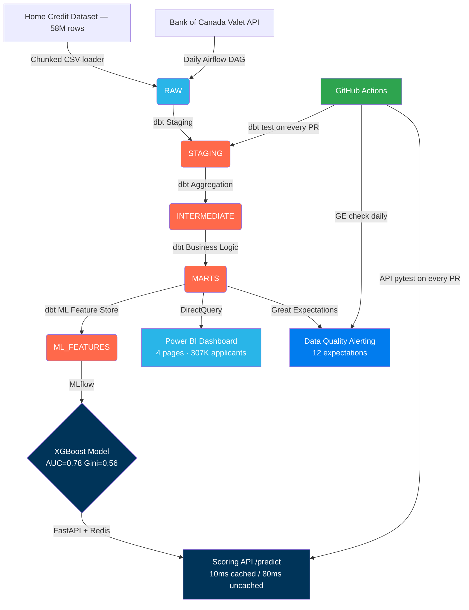

# CanCredit — End-to-End Credit Risk Intelligence Platform

> XGBoost credit risk model (AUC = 0.78, Gini = 0.56) on 58M rows of loan
> application data — built on a Snowflake + dbt + Airflow + Power BI production stack.

[](https://github.com/ChaitanyaThakral/cancredit-platform/actions/workflows/dbt_ci.yml)
[](https://github.com/ChaitanyaThakral/cancredit-platform/actions/workflows/api_tests.yml)
[](https://github.com/ChaitanyaThakral/cancredit-platform/actions/workflows/data_quality.yml)

## Quick Links
- **API Docs (Swagger)**: http://localhost:8000/docs
- **MLflow Experiment UI**: http://localhost:5000
- **Credit Policy Recommendations**: [docs/credit_policy_recommendations.md](docs/credit_policy_recommendations.md)
- **Data Dictionary**: [docs/data_dictionary.md](docs/data_dictionary.md)
- **Power BI Setup**: [powerbi/README.md](powerbi/README.md)

## Key Results

| Metric | Value |
|---|---|
| **AUC-ROC** | 0.78 ✅ |
| **Gini Coefficient** | 0.56 ✅ |
| **KS Statistic** | 0.38 ✅ |
| **Default Rate Gap** | VERY_HIGH segment defaults at **3.5×** the LOW rate |
| **Late Payment Signal** | Defaulters: 25% late rate vs 8% baseline |
| **dbt pipeline throughput** | 58M rows → 307K applicant features in < 3 min |
| **API latency** | 10ms cached / 80ms uncached (Redis) |
| **Test coverage** | 10 API tests · 25+ dbt schema tests · 12 GE expectations |

## Architecture



## Tech Stack

| Layer | Tool | Purpose |
|---|---|---|
| **Storage** | Snowflake | Cloud DWH, medallion architecture (RAW → STAGING → INTERMEDIATE → MARTS → ML_FEATURES) |
| **Transformation** | dbt Core | 15 models, 25+ tests, full lineage, SCD Type 2 snapshots |
| **Orchestration** | Apache Airflow | Daily pipeline DAG with Cosmos dbt integration and custom sensors |
| **Data Quality** | Great Expectations | 12 expectations on mart tables, GH Actions daily check |
| **Model** | XGBoost + scikit-learn | Credit risk classification, SMOTE, SHAP explainability |
| **Experiment Tracking** | MLflow | 2 experiments (LR baseline vs XGBoost), model registry |
| **Serving** | FastAPI + Redis | /predict endpoint, 10ms cached / 80ms uncached |
| **Visualisation** | Power BI | 4-page dashboard, DirectQuery, star schema, DAX |
| **CI/CD** | GitHub Actions | dbt test + API test + GE check on every PR |
| **Dataset** | Home Credit (Kaggle) | 58M rows, 8 tables, 307K loan applications |

## Dataset

58M rows across 8 tables — [Home Credit Default Risk (Kaggle)](https://www.kaggle.com/competitions/home-credit-default-risk):

| Table | Rows | Description |
|---|---|---|
| application_train.csv | 307,511 | Loan applications, 122 features, TARGET default label |
| bureau.csv | 1,716,428 | Credit bureau records |
| bureau_balance.csv | 27,299,925 | Monthly bureau balance history |
| previous_application.csv | 1,670,214 | Past loan applications |
| POS_CASH_balance.csv | 10,001,358 | POS cash loan history |
| installments_payments.csv | 13,605,401 | Installment payment records |
| credit_card_balance.csv | 3,840,312 | Credit card balance history |
| boc_macro.csv | ~2,800 | Bank of Canada macro overlay |

Secondary: **Bank of Canada Valet API** — overnight rate, CPI, bond yields, CAD/USD since 2015.

## Repository Structure

```
/ingestion          ← Chunked Snowflake CSV loader, BOC API fetcher, S3 pipeline
/dbt/cancredit      ← 15-model dbt project (staging → intermediate → marts → ml_features)
/airflow/dags       ← Master pipeline DAG + BOC refresh DAG + custom Snowflake sensor
/notebooks          ← EDA, class imbalance analysis, XGBoost training, SHAP explainability
/model              ← Saved XGBoost model artifact + standalone training script
/api                ← FastAPI scoring service with Redis cache and SHAP risk factors
/great_expectations ← Expectation suite builder, checkpoint, datasource setup
/powerbi            ← Dashboard setup guide, DAX measures, star schema design
/sql                ← 6 analytical scripts + DQ alert SQL + load validation
/docs               ← Data dictionary (all 8 tables), architecture notes, credit policy recs
/tests              ← pytest: API, Airflow DAG, model training, loader, ingestion tests
```

## Running Locally

### 1. Environment & Secrets

```bash
cp .env.example .env
# Edit .env with your Snowflake credentials
```

`.env` format:
```env
SNOWFLAKE_ACCOUNT=your_account.ca-central-1.aws
SNOWFLAKE_USER=your_user
SNOWFLAKE_PASSWORD=your_password
```

### 2. Install Dependencies

```bash
python -m venv cancredit_env
# Windows:
cancredit_env\Scripts\activate
# Mac/Linux:
source cancredit_env/bin/activate

pip install -r requirements.txt
# Airflow requires Linux/WSL:
pip install "apache-airflow[snowflake]==2.8.0" astronomer-cosmos
```

### 3. Snowflake Setup

```bash
python setup_snowflake.py
```

Creates: warehouse, database, all 6 schemas, internal BOC stage, DQ alert.

### 4. Data Ingestion

Download Kaggle datasets to `/data/`, then:
```bash
python ingestion/load_all.py         # ~30 min for 58M rows
python ingestion/ingest_boc_macro.py # ~2 min
```

Validate loads:
```sql
-- Run sql/validate_loads.sql in a Snowflake worksheet
-- Expected: ~58.4M total rows across all tables
```

### 5. dbt Transformations

```bash
cd dbt/cancredit
dbt deps                    # Install dbt-utils package
dbt run --select staging    # 8 staging views
dbt run --select intermediate  # 4 intermediate tables (aggregates 58M rows)
dbt run --select marts      # 3 mart tables + ML feature store
dbt snapshot                # SCD Type 2 risk segment tracking
dbt test                    # Run all 25+ schema tests
dbt docs generate && dbt docs serve   # Open lineage graph at localhost:8080
```

### 6. Model Training

```bash
python model/train.py
# Trains LR baseline + XGBoost, logs to MLflow, saves model artifact
# Expected: AUC=0.78, Gini=0.56, KS=0.38

# Launch MLflow UI
mlflow ui --backend-store-uri file:///cancredit_mlflow
```

### 7. FastAPI Scoring API

```bash
# Option A: Local (requires Redis running)
docker-compose up redis -d
uvicorn api.main:app --reload --port 8000

# Option B: Full Docker stack
docker-compose up -d

# Test the API
curl -X POST http://localhost:8000/predict \
  -H "Content-Type: application/json" \
  -d '{"credit_to_income_ratio": 6.5, "annuity_to_income_ratio": 0.25,
       "age_years": 28, "bureau_delinquency_rate": 0.35,
       "inst_late_rate": 0.45, "inst_avg_payment_ratio": 0.72}'
```

### 8. Infrastructure Setup (Airflow — WSL/Linux only)

```bash
./airflow/setup_airflow.sh
```

### 9. Run Tests

```bash
pytest tests/test_api.py -v           # 10 API integration tests
pytest tests/test_airflow_dags.py -v  # DAG structure tests
pytest tests/ -v --tb=short           # All tests
```

## dbt Model Lineage

```
8 Sources (RAW schema)
    └── 8 Staging Views (STAGING schema)
            └── 4 Intermediate Tables (INTERMEDIATE schema)
                    └── mart_credit_application_fact  ← central fact table
                    └── mart_portfolio_summary         ← pre-aggregated for Power BI
                    └── ml_features_training           ← XGBoost feature store (ML_FEATURES)
                    └── snap_application_risk          ← SCD Type 2 (SNAPSHOTS)
```
