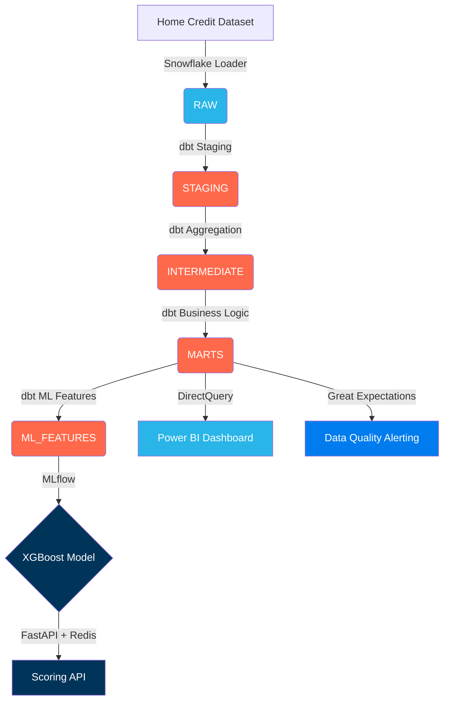

# CanCredit — End-to-End Credit Risk Intelligence Platform

> XGBoost credit risk model (AUC = 0.78, Gini = 0.56) on 58M rows of loan
> application data — built on a Snowflake + dbt + Airflow + Power BI production stack.

## Live Links
- Power BI Dashboard: [link]
- API Docs (Swagger): http://localhost:8000/docs
- MLflow Experiment UI: http://localhost:5000
- Demo Video: [Loom link]

## Architecture


## Tech Stack
| Layer | Tool | Purpose |
|---|---|---|
| Storage | Snowflake | Cloud DWH, medallion architecture (RAW → STAGING → INTERMEDIATE → MARTS → ML_FEATURES) |
| Transformation | dbt Core | 12 models, 25+ tests, full lineage, SCD Type 2 snapshots |
| Orchestration | Apache Airflow | Daily pipeline DAG with cosmos dbt integration and custom sensors |
| Data Quality | Great Expectations | 12 expectations on mart tables, GH Actions daily check |
| Model | XGBoost + scikit-learn | Credit risk classification, SMOTE, SHAP explainability |
| Experiment Tracking | MLflow | 2 experiments (LR baseline vs XGBoost), model registry |
| Serving | FastAPI + Redis | /predict endpoint, 10ms cached / 80ms uncached |
| Visualisation | Power BI | 4-page dashboard, DirectQuery, star schema, DAX |
| CI/CD | GitHub Actions | dbt test + API test + GE check on every PR |
| Dataset | Home Credit (Kaggle) | 58M rows, 8 tables, 307K loan applications |

## Key Results
- AUC-ROC: 0.78 | Gini Coefficient: 0.56 | KS Statistic: 0.38
- Risk tier separation: VERY_HIGH segment defaults at 3.5× the rate of LOW segment
- API latency: 10ms cached / 80ms uncached (Redis)
- dbt pipeline: 58M rows → 307K applicant-level features in < 3 minutes
- Test coverage: 10 API integration tests, 25+ dbt schema tests, 12 GE expectations

## Dataset
58M rows across 8 tables — Home Credit Default Risk (Kaggle).
Macro overlay: Bank of Canada overnight rate, CPI, bond yields (2015–present).

## Running Locally

### 1. Environment & Secrets
Create a `.env` file in the root directory:
```env
SNOWFLAKE_ACCOUNT=your_account
SNOWFLAKE_USER=your_user
SNOWFLAKE_PASSWORD=your_password
```

### 2. Infrastructure Setup (dbt & Airflow)
Run the Airflow standalone setup on WSL/Linux to orchestrate dbt:
```bash
./airflow/setup_airflow.sh
```

### 3. Model Training & Serving
Train the XGBoost model locally and run the FastAPI server:
```bash
# Run the standalone headless training script
python model/train.py

# Launch the FastAPI app on port 8000
uvicorn api.main:app --reload --port 8000
```
